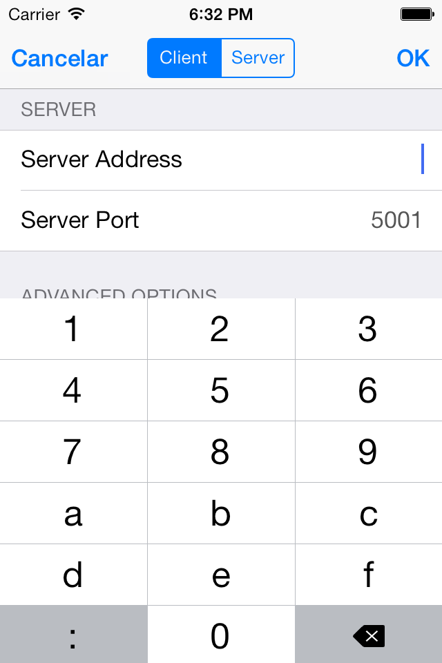
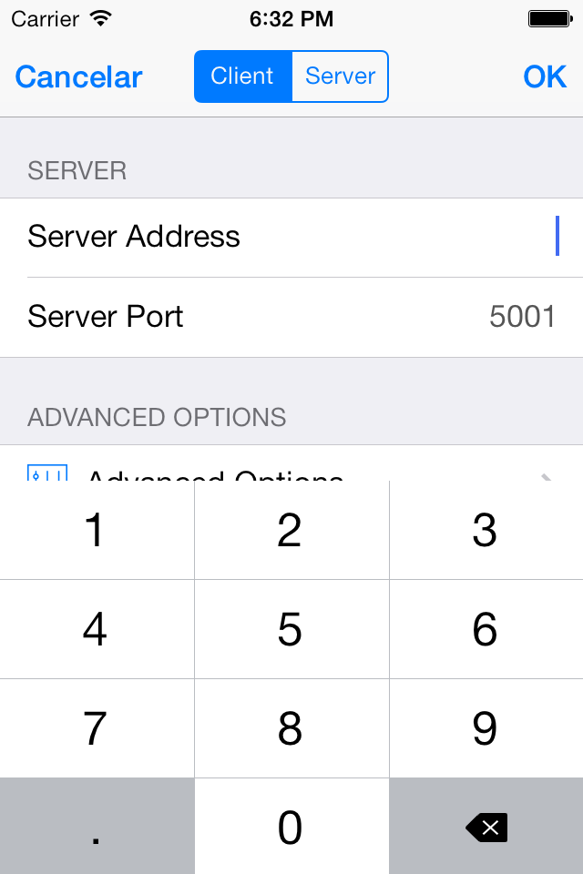

#NetAddressKeyboard

An iOS keyboard, that supports entering ip-values IPv4 and IPv6 to the UITextField for written in Objective-C for iOS7+.

## Installing and Usage

  - copy the **library** files to the project
  - set it to the *UITextField's inputView* in *-viewDidLoad* (or where you find it most suitable)
  - for IPv4: 
<code>aTextField.inputView = [[INNetAddressKeyboard alloc] initWithTextField:textModeServerAddress keyboardLayout:INNetAddressKeyboardIPv4];</code>
  - for IPv6:
<code>aTextField.inputView = [[INNetAddressKeyboard alloc] initWithTextField:textModeServerAddress keyboardLayout:INNetAddressKeyboardIPv6];</code>
  - make it better
  - enjoy!

## Screenshots

|IPv6|IPv4|
|---|---|
|||

## Thanks

The keyboard implementation is based on Hex Keyboard of doofyus/HexKeyboard to use it for IP addresses.
https://github.com/doofyus/HexKeyboard
